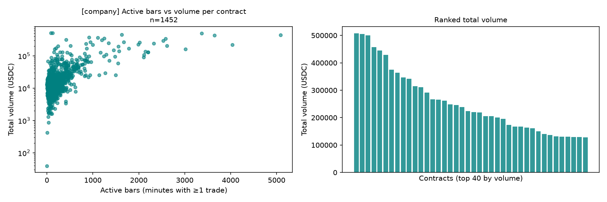
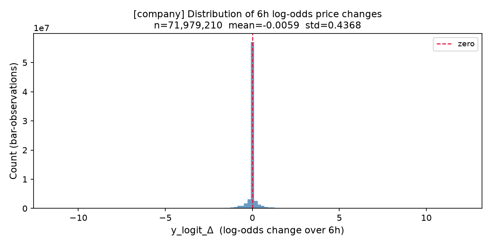
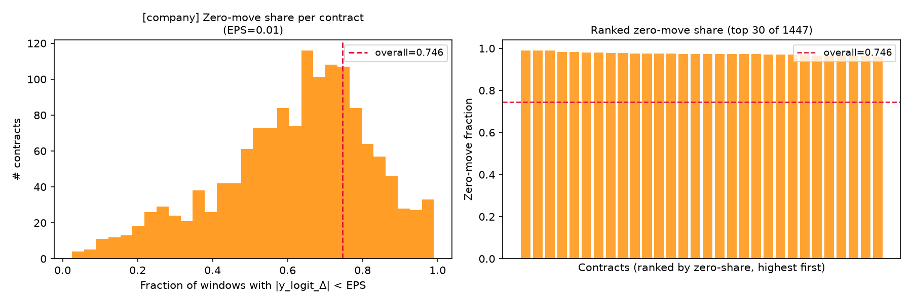
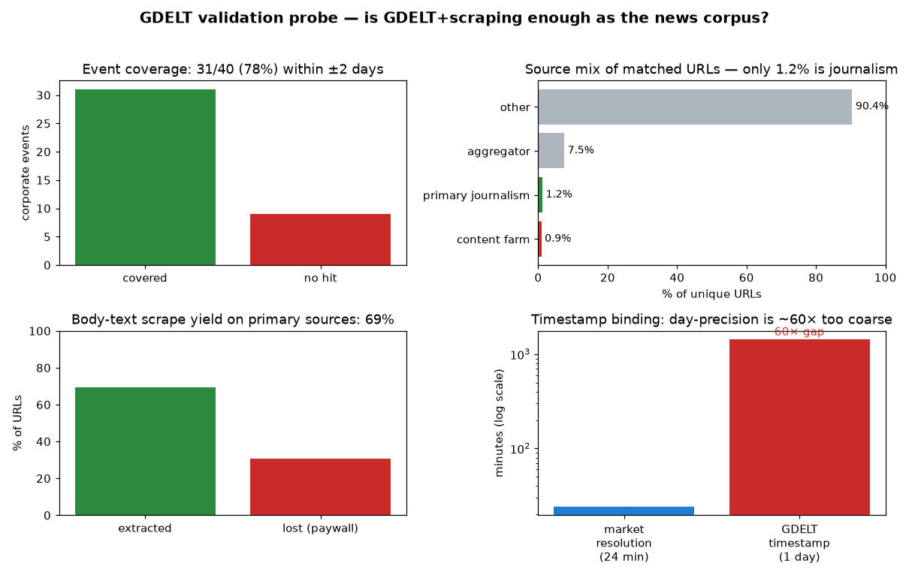

## Slide 1 — Company news shocks in Polymarket

Late-September data review · Avi Kabra · Applied Mathematics Senior Thesis, Yale University 
 Do prediction-market prices re-price when company news lands — and can we measure it cleanly? 
 This deck answers the three questions from our August meeting:
 (1) What is the usable market sample? (2) What does a real reaction look like?
 (3) Can we reliably match full articles to those contracts?

## Slide 2 — Since August, the pivot is done — and it holds

Then Sports, politics, and geopolitics together; headline-only text; a preliminary null result. 
 Now One coherent area — individual-company contracts — with real trade data and a full log-odds analysis. 
 
 Three concrete steps since then: 
 
 Built a clean company-contract universe from the full Polymarket history. 
 Pulled every real trade and measured how the prices actually move. 
 Audited the news coverage and tested, directly, whether we can match articles to contracts. 
 
 This deck reports what those three steps found.

## Slide 3 — The usable sample is 6,928 company contracts across 86 companies

Question 1 — the usable market sample 
 
 Scope: individual companies only — public equities plus a few private valuation ladders. Sports, politics, crypto, and index markets are filtered out. 
 Span: April 2024 – August 2026. 
 Structure: monthly stock-price "strike ladders" (e.g. "NVDA above $180 by month-end") grouped into parent/child families, plus one-off corporate events (earnings, M&A, executive changes). 
 Most-covered names: Apple, Google, Tesla, Microsoft, Amazon, Meta, Nvidia, Netflix, Palantir.

## Slide 4 — A liquid core exists — but activity is concentrated

Total lifetime volume across the universe: $79 million . 
 
 Liquidity floor Share of contracts 
 traded at all 93.6% 
 over $1,000 70.4% 
 over $10,000 21.0% 
 top 500 markets hold 62.6% of all volume 
 
 A defensible clean trading set — at least 200 trades and 10 active trading days — is 473 contracts . 
 Finding: there is a real, tradeable core; the thin long tail will be screened out before modelling.

## Slide 5 — A real reaction is mostly nothing, punctuated by large jumps

Question 2 — what a real reaction looks like 
 Measured on 72.5 million minute-by-minute observations from the liquid contracts. 
 Over any six-hour window, the price change is exactly zero 74.6% of the time . 
 Finding: most of the time the market simply does not trade, so it does not move. This is the single most important empirical fact of the review.

## Slide 6 — When the market does move, it moves a lot

Among the six-hour windows that are not flat, the typical move is 0.41 in log-odds , with a long tail past 5. 
 Reading log-odds 
 A price move from 0.40 to 0.44 is about +0.16 log-odds. A 0.41 move is a large, decisive swing in the implied probability — not noise. 
 Finding: the reaction is real and economically large — it is just sparse. The signal is there; the task is to not let the silence drown it.

## Slide 7 — The six-hour last-trade target manufactures zeros — so we won't use it blindly

Your caution was right: three-quarters of the apparent "reactions" are inactivity, not genuine non-response. So we will not fix the target on raw six-hour last-trade changes. We will build and compare three definitions: 
 
 A shorter window (1–2 hours). 
 Event- or trade-conditioned windows — measure the move around actual trades and news, not a fixed clock. (Most promising.) 
 The reaction on the clean, liquid set only. 
 
 The target is chosen from evidence, and the final call is yours.

## Slide 8 — We can find the news — but not cleanly enough yet, and we measured exactly how far it gets us

Question 3 — can we match articles to contracts? 
 The free option (GDELT) was audited over this universe, then run through a direct probe on 40 real corporate events: 
 
 Coverage: 78% of events have news within two days. 
 Quality: only ~1% of matched links are real journalism; the rest is filler and long-tail noise. 
 Full text: usable article bodies extract ~69% of the time (the rest are paywalled). 
 Timing: the market re-prices about every 24 minutes ; the free source only timestamps to the day — roughly 60× too coarse.

## Slide 9 — So matching must be learned, and the clean study needs a real news feed

Matching cannot be a keyword or similarity lookup: naive name-matching is only ~5% correct on a major company. It has to be a validated, learned link — narrowed first by company, ticker, time, and contract dates, then judged by a small model. 
 
 Now — free Build and validate the matching pipeline on GDELT + scraped text. Enough to prove the method works. 
 Final study A licensed newswire (Reuters or comparable) for minute-level timestamps and paywalled full text — the two gaps scraping cannot close. 
 
 Not a blocker: we proceed now and add the clean feed for the precision pass.

## Slide 10 — What changed since the preliminary run

Preliminary run (August) This review 
 Universe sports + politics + geopolitics one company-equity universe 
 Prices partial, headline-timed full real trade history 
 Zeros 66% — cause unclear 74.6% — explained (inactivity) 
 Matching assumed workable gap measured, not guessed 
 
 The preliminary run told us where the data broke. This review fixes the measurement before touching models.

## Slide 11 — Next steps: measurement first, models later

Build the matching pipeline on the free corpus and hand-audit a sample of matches. 
 Implement the three reaction-target definitions and compare them on the clean set. 
 Stand up Yale (Bouchet) compute for the embedding work; request the news feed for the precision pass. 
 
 Deferred, deliberately: LSTM / Transformer / TCN and cross-category comparisons — until clean matching and a usable target are proven. (Per your steer.)

## Slide 12 — Decisions made, and where I need you

Decided this cycle 
 
 Explore all three reaction-target definitions, then choose. 
 Keep both public equities and private valuation ladders, as two panels. 
 Model on the liquid subset (volume over $10k — 1,452 contracts). 
 
 Two things only you can do 
 
 Approve or route the news-feed request (Reuters, or the Yale library's existing entitlement). 
 Confirm you'll sponsor the Yale cluster account so I can submit the form.

## Slide 13 — Questions for Professor Kelly

Reaction target: shorter window, event-conditioned, or clean-set-only — which is most credible to you as the primary estimand? 
 Inferential unit: the news event, the individual contract, or a two-way event-by-contract structure? 
 Scope: keep the private valuation ladders in, or restrict to public equities? 
 News feed: request Reuters directly, or start from the library's existing entitlement?
