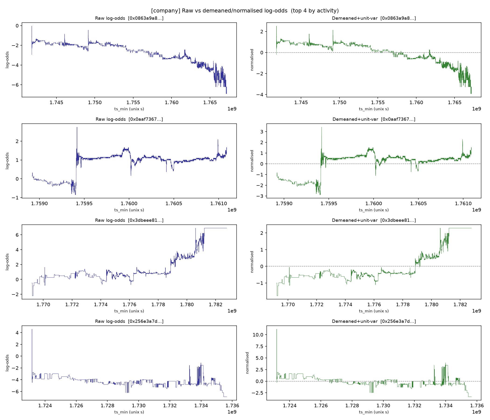

## Slide 1: Company News Shocks in Polymarket

Late-September data review 
 Avi Kabra · Applied Mathematics Senior Thesis · Yale University 
 Do prediction-market prices re-price when company news lands, and can we measure it cleanly?

## Slide 2: Since August, the pivot is done

- Was: sports, politics, and geopolitics; headline-only text; a preliminary null result. 

- Now: one area, individual-company contracts, with full real trade history and a complete log-odds analysis. 

- Built the universe, pulled every trade, audited the news, and tested matching directly.

## Slide 3: Q1: Usable sample of 6,928 contracts across 86 companies

- Individual companies only (public, plus a few private ladders). No sports, politics, crypto, or index markets. 

- Window: April 2024 to August 2026. 

- Two contract types: monthly price strike ladders and one-off corporate events . 
 
 

| Contract family | Contracts 

| Price ladders (monthly strikes) | 6,174 

| Corporate events (earnings, M&A, executives) | 470 

| Revenue ladders | 170 

| Valuation ladders (private companies) | 110 

| Market-cap ladders | 4

## Slide 4: Q1: A liquid core, but concentrated

| Liquidity floor | Share of contracts 

| Traded at all | 93.6% 

| Over $1,000 volume | 70.4% 

| Over $10,000 volume | 21.0% 

| Top 500 markets | 62.6% of all volume 
 
 

- Total lifetime volume: $79M . 

- Clean set (at least 200 trades and 10 active trading days): 473 contracts .

## Slide 5: Q2: A real reaction is mostly nothing, then a big jump

- Measured on 72.5M minute-by-minute observations from the liquid contracts. 
 
 

| Six-hour log-odds change | Value 

| Windows that are zero-move | 74.6% 

| Distribution mean | about 0 

| Distribution std. dev. | 0.44 
 
 

- Most of the time the market does not trade, so it does not move. This is the central fact.

## Slide 6: Q2: When it moves, it moves a lot

| Non-zero six-hour move | Log-odds 

| Median | 0.41 

| 90th percentile | 1.66 

| 99th percentile | 5.17 
 
 

- Reference: 0.40 to 0.44 is +0.16 log-odds. A 0.41 move is a decisive probability swing. 

- The reaction is real and economically large. It is just sparse.

## Slide 7: Q2: Demeaning and normalizing cleans the series

- Removing each contract's mean and scaling to unit variance removes level differences across contracts (different strikes and regimes). 

- Every contract is then on one comparable scale, expressed in standard-deviation moves. 

- The standardized series is the form the model consumes.

## Slide 8: Q3: Assessing GDELT as the article source

- The free option (GDELT), tested directly on 40 real corporate events: 
 

| Test | Result | Verdict 

| Event coverage (within 2 days) | 78% | partial 

| Primary journalism share | 1.2% | buried in noise 

| Body-text scrape yield | 69% | usable, biased 

| Market resolution vs. timestamp | 24 min vs. 1 day | about 60x too coarse

## Slide 9: Q3: Matching approach

What's there 
 

- Naive name-matching is about 5% correct on a major company. 

- GDELT supplies candidate links; usable article text recovers about 69% of the time. 
 
 Next steps 
 

- Filter candidates by company, ticker, time, and contract dates. 

- A small model judges relevance; validate on a hand-audited sample. 

- Add a licensed news feed for the precision pass.

## Slide 10: What changed since the preliminary run

| | Preliminary (August) | This review 

| Universe | sports, politics, geopolitics | one company-equity universe 

| Prices | partial, headline-timed | full real trade history 

| Zeros | 66% | 74.6%

## Slide 11: Next Steps

- Build the matching pipeline on the free corpus; hand-audit a sample of matches. 

- Define the reaction target and rerun on the clean set. 

- Run LSTM, Transformer, TCN, and cross-category comparisons. 

- Request the news feed for the precision pass.
